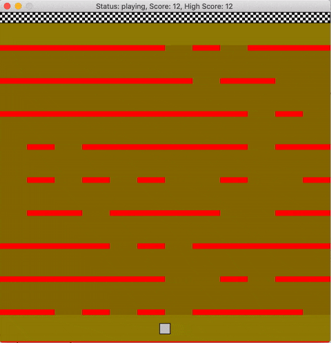

# Lava Runner
Lava Runner is a 2-D obstacle game built using the SDL library.


## Game Play
The player starts at the bottom and must reach the goal at the top without coming in contact with lava.
The lava obstacles include a field of lava pools and rising lava.
Entering the field of lava pools triggers the lava to start rising.
With each successful level completion, the game's difficulty will increase up to a maximum limit.
The increased difficulty will be a higher density of lava pools and the lava will rise faster.

## Game Controls
- Move the player using the up, down, left, and right arrows.
- Move the player faster by holding the space bar.
- Pause the game using the return key.
- Resume the game using any of the arrow keys or space bar.
- Reset the game using the escape key.
 
## Game Build
###### clone repo and cd into it
```
git clone https://github.com/kevinGodell/lava-runner.git
cd lava-runner
```
###### create a _release_ build
```
mkdir release
cd release
cmake .. -DCMAKE_BUILD_TYPE=Release
make
./lava_runner
```
###### create a _debug_ build
```
mkdir debug
cd debug
cmake .. -DCMAKE_BUILD_TYPE=Debug
make
./lava_runner
```
## Project Classes Overview
- All class methods and variables are descriptively named to indicate purpose.
- Controls class is a wrapper around SDL keyboard state.
- Game is the main class that contains the game loop.
- Game initializes SDL and exits upon error.
- Game manages 4 states: INIT, PLAY, PAUSE, and END.
- Sprite is a base class with virtual members.
- Sprite contains an SDL_Rect that is used as the derived classes hit area for collision detection.
- Player, Goal, Lava, and LavaPools inherit from Sprite.
- Player is the only Sprite controllable by user.
- Goal contains an SDL_Rect std::vector used for creating the checkered pattern.
- LavaPools contains a vector of Lava elements at random coordinates.
- LavaPools hit area triggers RisingLava to start rising.
- RisingLava inherits from Lava.
- RisingLava runs in a detached thread that increases its size at a specified rate.

## Project Rubrics
- ###### The project demonstrates an understanding of C++ functions and control structures.
  - Game.cpp line 71
- ###### The project accepts user input and processes the input.
  - Game.cpp line 148
- ###### The project uses Object Oriented Programming techniques.
  - Game.cpp line 101
- ###### Classes use appropriate access specifiers for class members.
  - Game.hpp line 17
- ###### Class constructors utilize member initialization lists.
  - Game.cpp line 8
- ###### Classes abstract implementation details from their interfaces.
  - LavaPools.hpp line 22
- ###### Classes encapsulate behavior.
  - RisingLava.cpp line 41
- ###### Classes follow an appropriate inheritance hierarchy.
  - RisingLava inherits from Lava which inherits from Sprite
- ###### Derived class functions override virtual base class functions.
  - Player.cpp line 11
- ###### The project makes use of references in function declarations.
  - Sprite.hpp line 21
- ###### The project uses destructors appropriately.
  - Game.cpp line 26
- ###### The project uses scope / Resource Acquisition Is Initialization (RAII) where appropriate.
  - LavaPools.cpp line 60
- ###### The project uses smart pointers instead of raw pointers.
  - LavaPools.cpp line 60
- ###### The project uses multithreading.
  - RisingLava.cpp line 44
- ###### A mutex or lock is used in the project.
  - RisingLava.cpp line 47